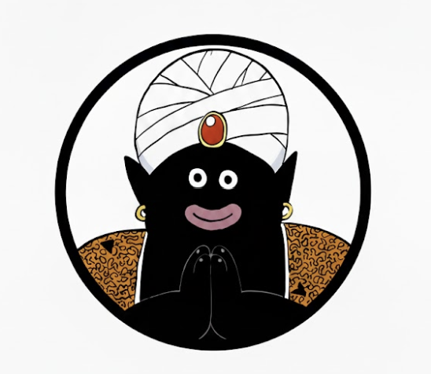

<p align="center">
  
</p>

<h1 align="center">AnimeQuiz</h1>

<p align="center">
  <strong>Blind test interactif sur les anime, films et series</strong>
</p>

<p align="center">
  
  
  
  
  
</p>

---

## Apercu

AnimeQuiz est une application web de blind test musical. Ecoute un extrait, devine le titre. Trois modes de jeu pour tous les niveaux.

<p align="center">
  
</p>

## Modes de jeu

### Quiz

Blind test sur les openings et endings d'anime. 15 questions, 10 secondes par extrait. Les donnees proviennent de l'API [AnimeThemes.moe](https://animethemes.moe/).

### Chill

Soundtracks d'anime, films et series. 12 questions, 20 secondes par extrait. Filtres par categorie : Anime, Films, Series ou tout melange.

### Training

Explore la base de donnees complete. Ecoute les openings et endings, decouvre les artistes et les annees. Scroll infini avec chargement progressif.

## Stack technique

| Technologie | Usage |
|---|---|
| **Next.js 16** | Framework React avec App Router |
| **React 19** | UI components |
| **TypeScript 5** | Typage statique |
| **Tailwind CSS 4** | Styling utility-first |
| **GSAP + ScrollTrigger** | Scroll animations (landing page) |
| **Lenis** | Smooth scroll |
| **TanStack React Query** | Data fetching et cache |
| **ReactPlayer** | Lecture audio/video |

## Installation

```bash
# Cloner le repo
git clone <url-du-repo>
cd quizz

# Installer les dependances
pnpm install

# Lancer en dev
pnpm dev
```

L'app sera accessible sur [http://localhost:3000](http://localhost:3000).

## Scripts

| Commande | Description |
|---|---|
| `pnpm dev` | Serveur de developpement |
| `pnpm build` | Build de production |
| `pnpm start` | Lancer le build de production |
| `pnpm lint` | Lancer ESLint |
| `pnpm fetch-youtube-ids` | Recuperer les YouTube IDs pour la BDD |

## Structure du projet

```
app/
  page.tsx              # Landing page avec scroll animations
  quiz/                 # Mode Quiz (openings/endings)
  chill/                # Mode Chill (soundtracks mix)
  training/             # Mode Training (exploration BDD)
  api/                  # Routes API
    generate-quiz/      # Generation de quiz aleatoires
    chill/              # Donnees soundtracks
    free/               # Cache anime themes
bdd/
  anime.ts              # 121 animes
  movie.ts              # 100 films
  serie.ts              # Series TV
components/
  Navigation.tsx        # Barre de navigation classique
  LandingNav.tsx        # Navigation glassmorphism (landing)
  AnimeList.tsx         # Grille anime avec lecteur audio
  quiz/                 # Composants du jeu
    phases/             # Ready, Countdown, Playing, Reveal, Finished
hooks/
  use-quiz-game.tsx     # State machine du jeu
  use-quiz.tsx          # Fetch quiz data
  use-chill.tsx         # Fetch chill data
  use-fetch.tsx         # Fetch anime database
lib/
  animeThemes.ts        # Integration API AnimeThemes.moe
```

## APIs utilisees

- **[AnimeThemes.moe](https://animethemes.moe/)** - Openings, endings et audio d'anime
- **YouTube** - Thumbnails et soundtracks (mode Chill)

## Licence

Projet prive.
